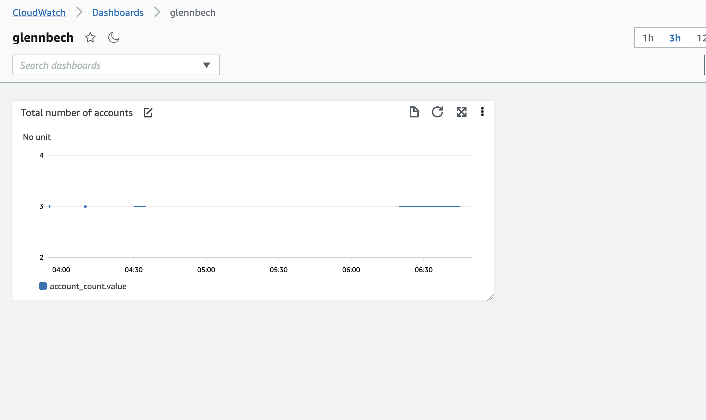

# Metrics og Alarmer med Spring Boot og CloudWatch + Terraform

I denne øvingen skal dere bli ennå bedre kjent med hvordan man instrumenterer en Spring Boot applikasjon med Metrics. 
Første delen av øvingen er lik https://github.com/glennbechdevops/cloudwatch_alarms_terraform - se på det som 
repetisjon :) 

* Vi skal også se på hvordan vi kan visualisere Metrics i AWS CloudWatch, og hvordan vi kan bruke terraform til å lage et dashboard i tjenesten CloudWatch 
* Vi få GitHub Actions til å kjøre terraform for oss 
* Vi skal se på CloudWatch alarmer    

## Vi skal gjøre denne øvingen fra Cloud 9 

Logg på Cloud 9 miljøet ditt som vanlig 

## Bruk Terraform til å lage et CloudWatch DashBoard 

* Klon (Ikke fork) dette repoet til Cloud9 miljøet ditt.  Se i katalogen "infra" - her finner dere filen *dashboard.tf* som inneholder Terraformkode for et CloudWatch Dashboard.

* Som dere ser beskrives dashboardet i et JSON-format. Her finner dere dokumentasjon https://docs.aws.amazon.com/AmazonCloudWatch/latest/APIReference/CloudWatch-Dashboard-Body-Structure.html
* Her ser dere også hvordan man ofte inkluderer tekst eller kode ved hjelp av  "Heredoc" syntaks i Terraformkode, slik at vi ikke trenger å tenke på "newline", "Escaping" av spesialtegn osv (https://developer.hashicorp.com/terraform/language/expressions/strings)

```hcl
resource "aws_cloudwatch_dashboard" "main" {
  dashboard_name = var.student_name
  dashboard_body = <<THEREBEDRAGONS
{
  "widgets": [
    {
      "type": "metric",
      "x": 0,
      "y": 0,
      "width": 12,
      "height": 6,
      "properties": {
        "metrics": [
          [
            "${var.student_name}",
            "account_count.value"
          ]
        ],
        "period": 300,
        "stat": "Maximum",
        "region": "eu-west-1",
        "title": "Total number of accounts"
      }
    }
  ]
}
THEREBEDRAGONS
}
```
## TODO 

* Skriv en *provider.tf* i samme katalog som dashboard.tf - og kjør terraform plan / apply fra Cloud 9 miljøet ditt
Se at Det blir opprettet et Dashboard

* Når du kjører plan- eller apply vil Terraform spørre deg om ditt studentnavn. 
* Hvordan kan du sende variabelverdier direkte i terraform kommandolinjen?
* Lag en Defaultverdi for variabelen, se at du da også ikke blir bedt om å oppgi studentnavn på ```plan/apply```
* Kjør Terraform  init / plan / apply from Cloud9-miljøet ditt

## Se på Spring Boot appen 

Åpne *BankAccountController.Java* , Her finner dere koden

```java
    @Override
    public void onApplicationEvent(ApplicationReadyEvent applicationReadyEvent) {
        Gauge.builder("account_count", theBank,
                b -> b.values().size()).register(meterRegistry);
    }
```
Denne lager en Ny metric - av typen Gauge. Hver gang data sendes til CloudWatch leses denne av og vil rapportere hvor mange bank-kontoer som eksisterer i systemet 

## Endre MetricConfig klasse

Du må endre på klassen *MetricsConfig* og bruke ditt egent studentnavn istedet for *glennbech* i kodeblokken 

````java
 return new CloudWatchConfig() {
        private Map<String, String> configuration = Map.of(
                "cloudwatch.namespace", "glennbech",
                "cloudwatch.step", Duration.ofSeconds(5).toString());
        
        ....
    };
````

Installer maven i Cloud 9. Vi skal forsøke å kjøre Spring Boot applikasjonen fra Maven i terminalen

```
sudo wget http://repos.fedorapeople.org/repos/dchen/apache-maven/epel-apache-maven.repo -O /etc/yum.repos.d/epel-apache-maven.repo
sudo sed -i s/\$releasever/6/g /etc/yum.repos.d/epel-apache-maven.repo
sudo yum install -y apache-maven
sudo yum install jq
```

## Start Spring Boot applikasjonen 

Start applikasjonen med Cloud 9'
```
mvn spring-boot:run
```

Koden i dette repoet eksponerer et REST grensesnitt på http://localhost:8080/account

## Kall APIet fra en terminal I Cloud 9 

* Opprette konto, eller dette saldo

```sh
curl --location --request POST 'http://localhost:8080/account' \
--header 'Content-Type: application/json' \
--data-raw '{
    "id": 1,
    "balance" : "100000"
}'|jq
```

* Se info om en konto
```sh 
  curl --location --request GET 'http://localhost:8080/account/1' \
  --header 'Content-Type: application/json'|jq
```

* Overføre penger fra en konto til en annen

```sh
curl --location --request POST 'http://localhost:8080/account/2/transfer/3' \
--header 'Content-Type: application/json' \
--data-raw '{
    "fromCountry": "SE",
    "toCountry" : "US",
    "amount" : 500
}
'|jq
```

## Sjekk at det kommer data i CloudWatch- Dashbordet 

Det skal se omtrent slik ut 

* Går til AWS UI, og tjenesten CloudWatch. Velg "Dashboards".
* Søk på ditt eget studentnavn og åpne dashboardet du lagde
* Se at du får målepunkter på grafen



# Gauge for banken sin totale sum

Under normale forhold kal denne summen være 0. Når penger går inn på en konto, skal de også gå ut av en annen!
Banken må kunne bevise at summen hele tiden er 0, og vi vil derfor lage en metric for dette i koden

Du skal nå lage en Micrometer ```Gauge``` som viser nettobeholdningen til banken. 

TODO: Plasser denne på riktig sted i koden. 

```java
// Denne meter-typen "Gauge" rapporterer hvor mye penger som totalt finnes i banken
Gauge.builder("bank_sum", theBank,
                b -> b.values()
                        .stream()
                        .map(Account::getBalance)
                        .mapToDouble(BigDecimal::doubleValue)
                        .sum())
        .register(meterRegistry);
```

## Lag en ny Widget CloudWatch Dashboardet 

Utvid Terraformkoden slik at den viser en ekstra widget for metrikken ```bank_sum```
Hint: du må endre på X/Y verdiene for at de ikke skal overlappe!

## Cloudwatch Alarm

Vi vil lage en Alarm som utløses dersom banken sin totale sum overstiger 0. 
Dette kan vi gjøre ved å lage en CloudWatch alarm.

Hvis noe skal skje når en alarm løses ut, kan vi få den til å sende en meldng til en SNS topic.
Vi kan så lage en "subscription" på denne Topicen som får meldinger som sendes til den. 

Lag en ny terraform fil i samme katalog som de andre med følgende innhold. Husk å endre på e-postaddressen 
Du kan kalle filen hva du vil, Husk at terraform prosesserer alle ```*.tf``` filer i katalogen du starter i - uavhengig av filnavn

```hcl

resource "aws_cloudwatch_metric_alarm" "zerosum" {
  alarm_name                = "bank-sum-must-be-0"
  namespace                 = "glennbech"
  metric_name               = "bank_sum.value"

  comparison_operator       = "GreaterThanThreshold"
  threshold                 = "0"
  evaluation_periods        = "2"
  period                    = "60"

  statistic                 = "Maximum"

  alarm_description         = "This alarm goes off as soon as the total amount of money in the bank exceeds 0 "
  insufficient_data_actions = []
  alarm_actions       = [aws_sns_topic.user_updates.arn]
}

resource "aws_sns_topic" "user_updates" {
  name = var.student_name
}

resource "aws_sns_topic_subscription" "user_updates_sqs_target" {
  topic_arn = aws_sns_topic.user_updates.arn
  protocol  = "email"
  endpoint  = "glenn.bech@gmail.com"
}

```

### Litt forklaring 

* Namespace er studentnavnet ditt, skal ikke være glennbech! Det finner du igjen i CloudWatch Metrics
* Det finnes en lang rekke ```comparison_operator``` alternativer
* ```evaluation_periods``` og ``period`` jobber sammen for å unngå at alarmen går av ved en kortvarige "spikes" eller uteliggende observasjoner. 
* ```statistic``` er en operasjon som utføres på alle verdier i ett tidsintervall gitt av ```period``` - for en ```Gauge``` metric, i dette tilfelle her er det Maximum som gir mening  
* Legg merke til hvordan en ````resource``` refererer til en annen i Terraform!


### Løs ut alarmen! 

* Forsøk å endre en konto sin saldo uten å gjøre en overfløring, dette vil gi en balanse i banken sin totale saldo ulik 0!

For eksmpel ;
```sh
curl --location --request POST 'http://localhost:8080/account' \
--header 'Content-Type: application/json' \
--data-raw '{
    "id": 999,
    "balance" : "50000"
}'|jq
```

* Sjekk at alarmen går 
* Gå til CloudWatch Alarms i AWS og se at alarmen sin tilstand er ```IN_ALARM```
* Få balansen i banken tilbake til 0 
* Se at alarmen sin tilstand går vekk fra ```IN_ALARM``` . 

## GitHub actions Workflow for å kjøre Terraform. 

Basert på for eksempel denne labben https://github.com/glennbechdevops/terraform-app-runner - lag en GitHub actions workflow fil 
for Terraform-koden i dette repositoryet slik at 

* Hver commit på main branch kjører Terraform-apply
* For en Pull request, gjør bare Terraform plan 

Du trenger ikke lage en Pipeline for Java applikasjonen, kun for Terraform!

## Ekstrapppgaver

* Legg til nye Metrics i koden og Widgets i Dashboardet ditt
* Kan du lage en eller flere nye alarmer? Eksempel; En alarm trigges av antall requests over en tidsperiode går over en terskelverdi? Sett verdien lavt så du klarer å teste :) 
* Kan du lage et nytt endepunkt med ny funksjonalitet? 
* Bruk gjerne følgende guide som inspirasjon https://www.baeldung.com/micrometer
* Referanseimplementasjon; https://micrometer.io/docs/concepts

Nyttig informasjon; 

- https://spring.io/blog/2018/03/16/micrometer-spring-boot-2-s-new-application-metrics-collector
- https://docs.spring.io/spring-boot/docs/current/reference/htmlsingle/#production-ready-metrics
- 